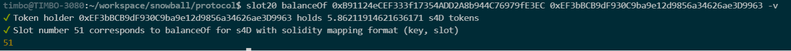

# Snowball Contract Testing :computer:

## Existing Tests

- Single-Asset folding strategies

## Running Tests

Tests can be ran with the following:

```bash
npx hardhat test
```

To run the tests with a persistent state, you can change networks through inspecting MetaMask or run the following:

```bash
npx hardhat node
```

...and in another terminal window:

```bash
npx hardhat test --network localhost
npx hardhat console --network localhost
```

## Tests on Deployed Contracts

Many of the existing tests are running on already deployed contracted addresses and ABI files.

If there are valid `.sol` files in the repository, but the contracts are already deployed, use the following:

```
const globeContract = await ethers.getContractAt("SnowGlobeBenqiWbtc", snowglobeAddr,  governanceSigner);
```

## Tests on New Strategies

To simulate the deployment of a new strategy, use the following:

```
const stratFactory = await ethers.getContractFactory("StrategyBenqiWbtc");
const deployedStrat = await stratFactory.deploy(governanceAddr, strategistAddr, controllerAddr, timelockAddr);
```

This code will create a factory, and through `deploy()` create an instance of that contract.

## Finding token slots

These tests use hardhat's overwrite functionality to give accounts token balances. To accomplish this,
we need to specify which memory slot to overwrite in the token's contract on the forked chain. 

[Install Slot20 CLI app](https://github.com/kendricktan/slot20)

After the above is installed, complete the following
1) Run a local hardhat instance `npx hardhat node`
2) call `slot20 balanceOf {contract_addr} {balance_holder_addr} -v` 
e.g. 
3) Add slot number to helpers::findSlot() function 

N.B. If you are finding it hard to find an account with active balance of said token, you can always use a few dollars worth of real money to acquire token and restart the hardhat node.

